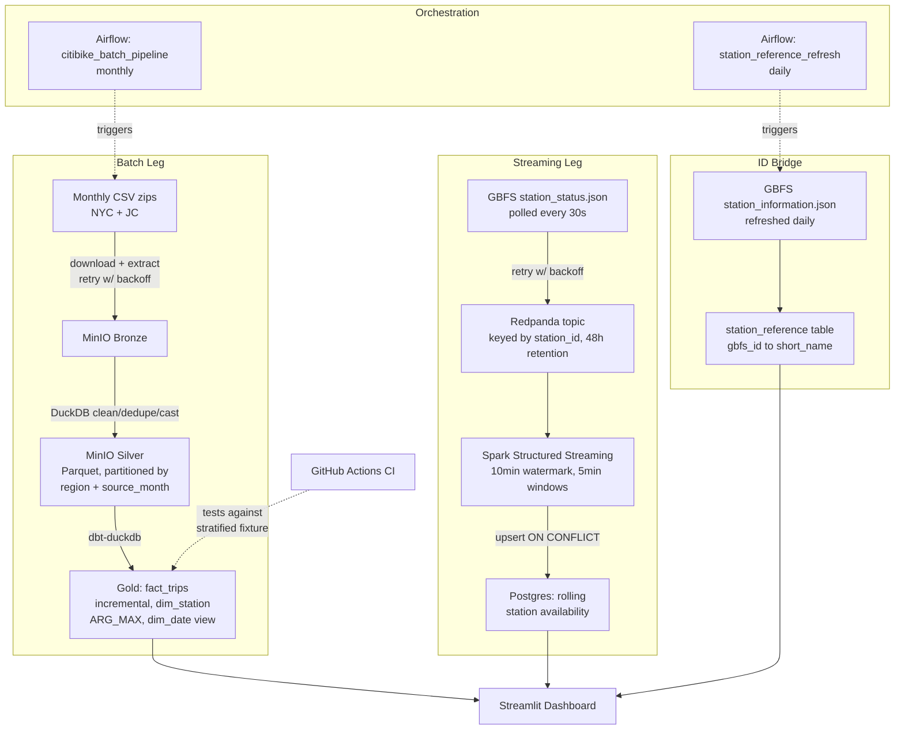

# Citi Bike Analytics Platform — Batch + Streaming

An end-to-end data engineering pipeline combining historical trip analytics (batch) 
with live station availability (streaming), joined into a single dashboard. Built 
entirely on free, open infrastructure, running locally via Docker Compose.

This isn't a from-scratch design that worked on the first try — several real bugs 
were found and fixed along the way (silent data loss from a partitioning bug, a 
duplicate-window bug in the streaming aggregation, a station-ID scheme mismatch 
between the two data sources). Those are documented below and in full detail in 
[`DECISIONS.md`](./DECISIONS.md), because the debugging is as much the point of 
this project as the architecture is.

## What it does

- Ingests monthly historical Citi Bike trip data (NYC + Jersey City/Hoboken) and 
  builds a star-schema warehouse (`fact_trips`, `dim_station`, `dim_date`) for 
  historical demand analysis.
- Polls Citi Bike's live GBFS feed every 30 seconds and maintains a rolling 
  5-minute average of bike/dock availability per station.
- Bridges the two — despite the batch and streaming feeds using **completely 
  different station ID schemes** — into one live dashboard showing historical 
  patterns alongside real-time station status.
- Runs unattended: new months are picked up automatically via Airflow, proven 
  idempotent and tested against a live, un-downloaded month.

## Architecture



## Tech stack

| Layer | Tool | Why |
|---|---|---|
| Batch orchestration | Apache Airflow (LocalExecutor) | Industry standard for scheduled pipelines |
| Batch processing | DuckDB | Sufficient and simpler for this data volume (~1.2GB/month) — see engine choices below |
| Streaming broker | Redpanda | Kafka-API compatible, single binary, lighter than Kafka+ZooKeeper on a laptop |
| Stream processing | PySpark Structured Streaming | Only viable option for windowed aggregation, watermarking, and checkpoint recovery |
| Data lake | MinIO + Parquet | S3-compatible, mirrors real cloud object storage |
| Transformation | dbt-core (duckdb adapter) | Star schema, incremental models, built-in testing |
| Warehouse (streaming) | Postgres | Upsert support for idempotent windowed writes |
| Dashboard | Streamlit | Zero-friction querying across DuckDB + Postgres via DuckDB's postgres extension |
| CI | GitHub Actions + dbt | Tests run against a stratified sample fixture, no live infra dependency |

## Engineering decisions worth knowing about

Full detail in [`DECISIONS.md`](./DECISIONS.md). The highlights:

**Silent data loss from a partitioning bug.** Silver was originally partitioned by 
`year_month` derived from `started_at`. Citi Bike's monthly files include a small 
number of trips that spill into the adjacent month (an export-boundary artifact, 
not a bug on their end). Because DuckDB's partitioned write replaces the entire 
partition file rather than merging, processing June's file — which contained a 
few hundred May-dated rows — **overwrote May's full ~4.7M-row partition** with 
just those leaked rows. Caught by manually inspecting row counts, not by any 
automated check. Fixed by separating the trip's true calendar month (`trip_month`, 
used for analytics) from the ingestion run's target partition (`source_month`, 
used only for writing) — the two were never the same concept and shouldn't have 
shared a column.

**A false "success" in Airflow.** During a run affected by container RAM pressure, 
a retried task was manually marked-success in the UI without actually re-running — 
meaning Airflow's history said a step completed when it hadn't been verified. 
Resolved by independently confirming the real output (`dbt test`, actual row 
counts) rather than trusting the marked state, then clearing the task instance so 
the DAG's history stayed honest.

**A self-diagnosed duplicate-window bug in streaming.** The same station appeared 
twice for one 5-minute window in Postgres output. Root cause: `foreachBatch` + 
JDBC append mode wrote every micro-batch's intermediate state for windows that 
hadn't closed yet. Fixed with two changes working together — idempotent upsert 
(`ON CONFLICT`) makes repeated writes to an open window safe, and a 10-minute 
watermark decides when a window is actually final. Neither alone was sufficient.

**Two data sources, two incompatible ID schemes.** The live GBFS feed identifies 
stations by an internal UUID/long-numeric ID; historical trip data uses an older 
short-code scheme (`HB407`, `JC094`). A direct join matched 0 of 2,520 stations. 
The bridge — GBFS's `station_information.json` exposes a `short_name` field 
matching the historical format — resolved 95.4% of stations (2,408 of 2,523); 
the remaining gap is attributed to station churn between when each dataset was 
captured.

**Why Spark for streaming but not batch.** This isn't inconsistent — DuckDB has 
no streaming engine at all (no windowed aggregation over continuous data, no 
watermarking, no checkpoint recovery), so Spark wasn't chosen over DuckDB for 
streaming, it was the only tool that could do the job. For batch, both engines 
are equally capable at this data volume, so the simpler one was kept.

## Known limitations

- **Batch and streaming timestamps are on different clocks.** Batch data 
  (`started_at`/`ended_at`) is naive local NYC time; streaming data (`event_time`) 
  is UTC, per Spark's default. This doesn't affect the ID bridge (a station-identity 
  join, not time-based), but would silently misalign any future analysis 
  correlating the two legs by time-of-day.
- **Rebalancing trucks aren't distinguishable from organic ridership.** The GBFS 
  feed only reports net bike counts per poll — there's no signal indicating 
  *why* a count changed. A large single-interval jump from a truck restock is 
  currently indistinguishable from many simultaneous returns, and both blend into 
  the rolling average. A viable future heuristic: flag single-poll deltas beyond 
  a threshold as likely non-organic and exclude them from demand-oriented metrics.
- **Streaming uses at-least-once, not exactly-once, semantics.** A Spark failure 
  between computing and committing a batch could cause a window to be recomputed 
  and rewritten (with an accurate, but re-derived, value). True exactly-once would 
  need a transactional outbox pattern coordinating Kafka offset commits with the 
  Postgres write — not implemented, since staleness within a 10-minute window is 
  acceptable for inherently approximate, 30s-repolled data.
- **Region inference is filename-coupled.** Region (`jc`/`nyc`) is inferred from a 
  substring in the source filename. An unrecognized filename silently defaults to 
  `nyc` rather than erroring.
- **`dim_station` is full-refresh, not a slowly changing dimension.** Station 
  renames or corrected coordinates would overwrite in place with no history — 
  acceptable at this table's size (~2,500 rows), but a real SCD Type 2 pattern 
  would be needed for full historical accuracy.
- **CI tests Silver's output guarantees, not the cleaning logic itself.** The CI 
  fixture is sampled from already-cleaned Silver data, so it validates 
  `not_null`/`unique`/`relationships` tests on Gold models, but doesn't re-exercise 
  the null-filtering/dedup rules that produced Silver in the first place.

## Setup

```bash
git clone <this-repo>
cd citi-bike-analytics
docker-compose up -d
```

This starts MinIO, Postgres (warehouse + Airflow metadata, separate instances), 
Redpanda, the GBFS producer, Spark, and Airflow.

**Trigger the batch pipeline** (Airflow UI at `localhost:8080`, default `admin`/`admin`):
1. Unpause `citibike_batch_pipeline`
2. Trigger DAG w/ config → set `year_month` (e.g. `"202608"`)
3. Unpause and trigger `station_reference_refresh` once manually (don't wait for its daily schedule)

**View the dashboard:**
```bash
streamlit run app.py
```

**Run tests locally:**
```bash
cd citibike_dbt
dbt build --target ci   # against the sample fixture, no infra needed
dbt build --target dev  # against live Silver/MinIO, requires the stack running
```

## What I'd do with more time

- Slowly changing dimension handling for `dim_station`
- A heuristic to separate truck redistribution from organic ridership in the 
  streaming aggregation
- Geographic clustering analysis of currently-empty stations (proposed, not pursued)
- Terraform-provisioned BigQuery sandbox mirroring the Gold layer, to demonstrate 
  cloud IaC without any cost
